## 新Windows配置C#开发环境(.NET Core)

平时需要使用C#进行开发，但是又不想下载VS，VS的体积太大，电脑跑起来比较吃力，所以直接下载.NET Core来配置C#的开发环境，体积小，而且跟vscode一起使用基本上够用了。下面就是配置的过程，环境是：windows 10.

### 下载和安装：

1、浏览器打开网址：[官网](https://dotnet.microsoft.com/download/dotnet-core) 选择合适的版本。示例，我选择.NET Core 3.1版本。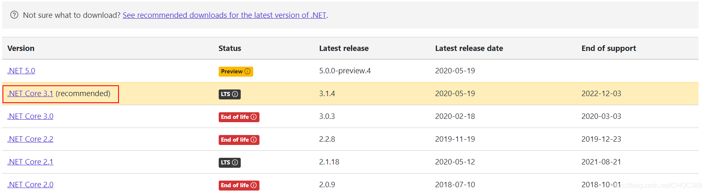

2、在Build apps-SDK 表中选择自己的平台，然后选择下载，示例：我的系统是window 64位系统，下载 Windows x64。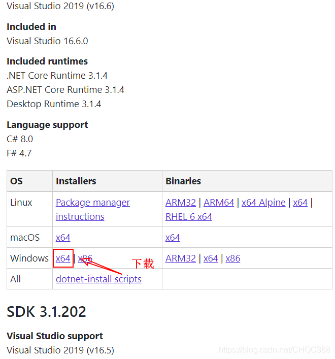

3、找到适合的位置保存即可。示例：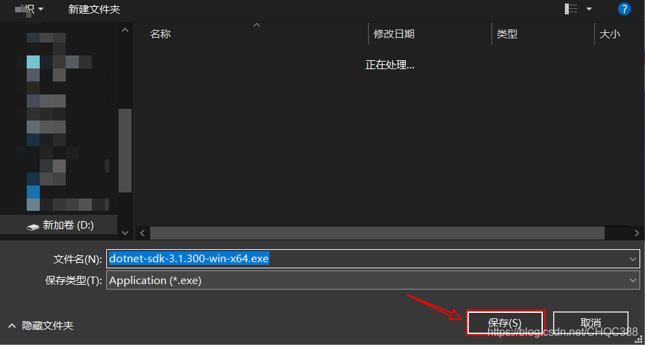

4、找到安装文件，直接双击安装即可。

### 简单使用：

1、使用快捷键win+R打开运行窗口，输入cmd回车打开命令行窗口，在命令行窗口中输入dotnet 回车。示例：说明安装成功。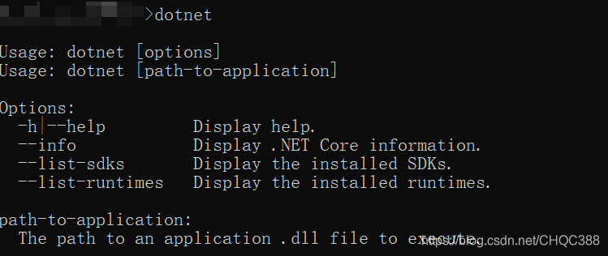

2、根据提示输入dotnet --info 回车 来查看.NET Core的信息，示例：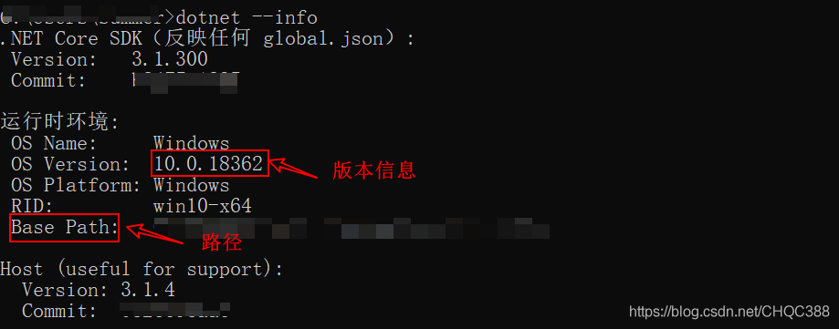

3、使用dotnet --help 回车 来查看notnet的使用，示例：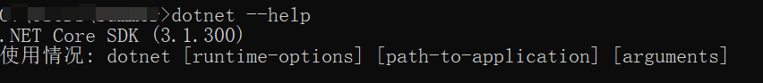

下拉到SDK命令，这部分命令在创建项目的时候需要使用，如果忘记或者不知道可以到这里查看，示例：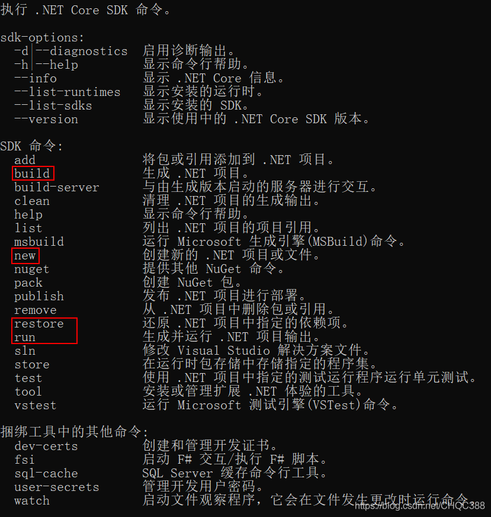

**提示**：用红色方框圈出来的命令在创建项目的时候需要使用到。

4、使用命令行创建一个C# console项目：

（1）在命令行窗口中使用cd命令进入一个适合的路径，然后输入命令：dotnet new console --name HelloCsharp 回车，示例：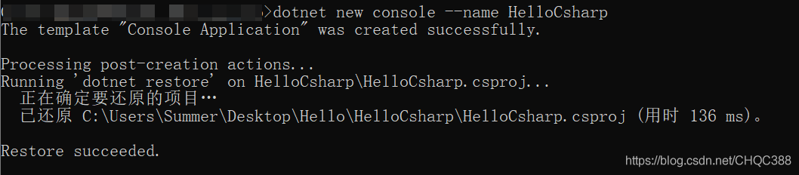

**提示**：其中new console 表示创建一个控制台项目，--name HelloCsharp 表示创建的工程名为HelloCsharp。

（2）打开创建好的工程，然后里面有一个初始化了的Program.cs文件，这个是初始化的Csharp文件。使用记事本或者其他工具打开它，然后在里面添加一行代码：Console.WriteLine("Hello Csharp!");保存然后退出，回到命令行窗口，然后进入工程目录。示例：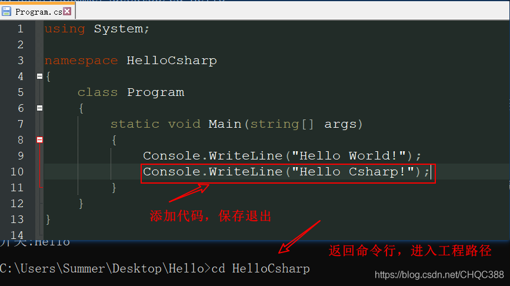

3）在命令行窗口中输入：dotnet build 回车，然后再输入命令：dotnet run 回车，就可以看到程序运行成功。示例：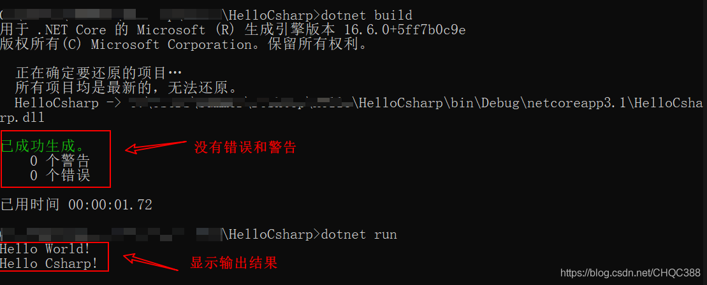

**提示**：dotnet build 表示编译工程，dotnet run 表示运行工程。

**至此，C#的开发环境就配置好了，你可以使用.NET Core来创建不同的工程，来实现你的需求**。

# 调试F5

有两处需要修改

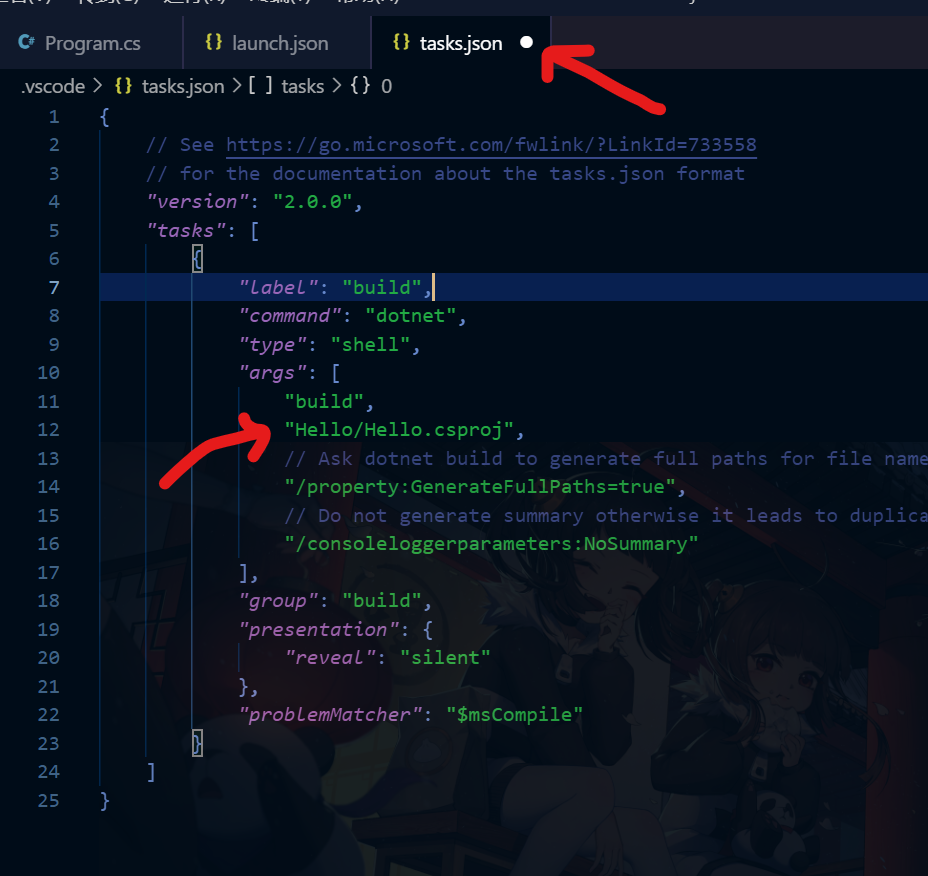

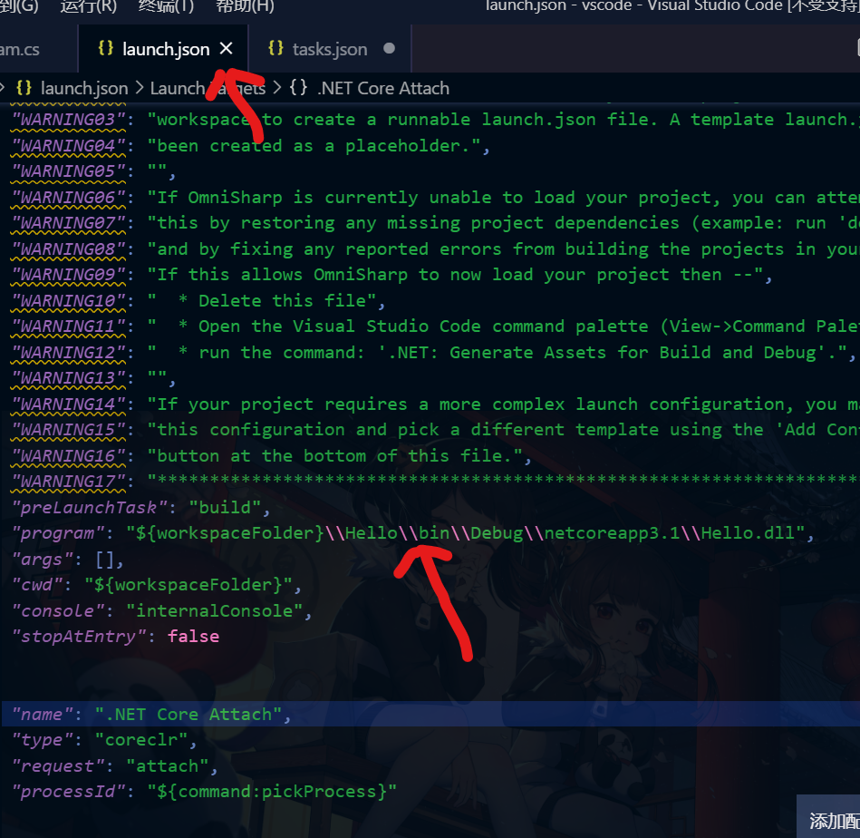