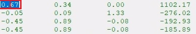
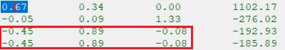
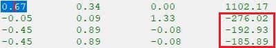
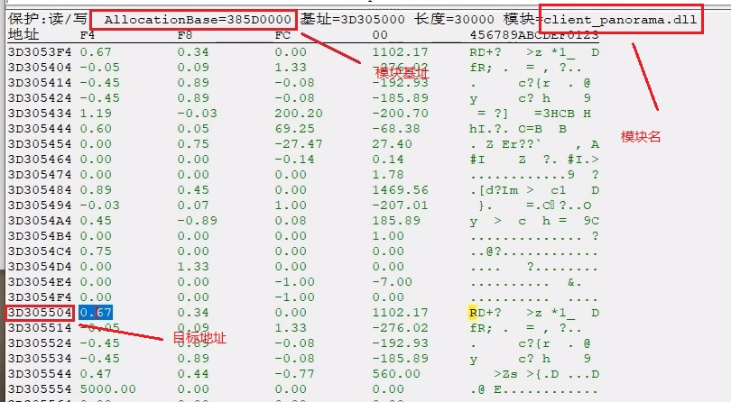

# 矩阵

## 1.自己矩阵的特征：4x4的

第一个特征：

```
array[0][0]

- 不开镜的时候小于1
- 第一次开镜会大于1
- 第二次开镜会到5
```



---

第二个特征：

```
array[3][0]		array[3][1]		array[3][2]
array[4][0]		array[4][1]		array[4][2]
(相同)		   (相同)			  (相同)
```



---

​		第三个特征：

```
array[2][4]
array[3][4]
array[4][4]
(很像是坐标)
```



---

## 2. 矩阵的基址和偏移



目标地址 - 模块基址 = 偏移

