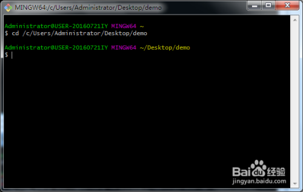
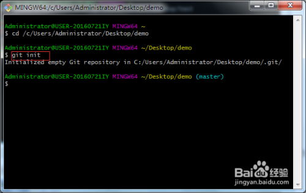
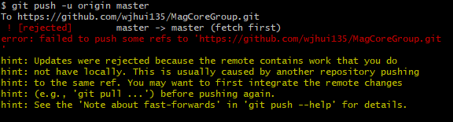
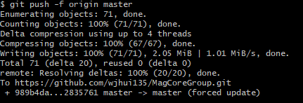

# git
```
…or create a new repository on the command line
echo "# VNote" >> README.md
git init
git add README.md
git commit -m "first commit"
git branch -M main
git remote add origin https://github.com/ccccccccccooooo/VNote.git
git push -u origin main

…or push an existing repository from the command line
git remote add origin https://github.com/ccccccccccooooo/VNote.git
git branch -M main
git push -u origin main
```

## 新建一个github本地仓库
```cpp
git init
```
## 配置config
```cpp
git config --global user.name "用户名"
git config --global user.email "电子邮箱"
```
## 添加目录
```cpp
git add 目录
git add .
```
## 克隆到本地

在本地新建一个文件夹，作为本地仓库，如“demo”。打开git，输入命令：

cd /c/Users/Administrator/Desktop/demo  然后按回车键进入到该文件夹目录下，如下图：



第二步：将本地仓库初始化，命令：git init  如下图：



第三步：将你需要的项目从github或者服务器上克隆下来，命令：git clone url   url为项目服务器地址或github地址，我这里以克隆github上的PHPMailer项目为例子，如下图所示：


## ! [rejected] master -> master (fetch first)问题的解决方案



分析原因，基本上可以确定是因为github上的远程库与本地库版本不一致（我对github上的文件做了编辑操作，且未更新到本地，当然也可能还有其他原因…），通过一番研究，找到了两种解决方案：

### 温柔型方案：

1. 通过git pull 先将本地库更新到与远程库一致的版本，但要注意本地库后来做的修改可能被覆盖，最好使用git fetch(不会自动合并)，查看更新情况再有选择合并，或者先将本地库修改过的文件备份，git pull后再重新修改；
2. 再运行git push即可成功。

### 暴力型方案：

1. git提供了一种强制上传的方式：git push -f ，它会忽略版本不一致等问题，强制将本地库上传的远程库，但是一定要谨慎使用，因为-f会用本地库覆盖掉远程库，如果远程库上有重要更新，或者有其他同伴做的修改，也都会被覆盖，所以一定要在确定无严重后果的前提下使用此操作。
   

# 如何解决git上传文件出错[rejected] master -> master (fetch first) error: failed to push some refs to '

## 刚开始用git上传文件的时候遇到了一些问题

### 第一个问题

上传步骤：
`git add .`
`git commit -m "提示消息"`
`git push origin master`

出错：
`! [rejected] master -> master (fetch first) error: failed to push some refs to ' 。。。'`

出现这个问题是因为github中的README.md文件不在本地代码目录中，可以通过如下命令进行代码合并

```
git pull --rebase origin master
```

### 第二个问题

```
! [remote rejected] master -> master (pre-receive hook declined)
```

在推送代码时报错如上，网上搜到的方法说是项目的setting中master是受保护的项目，所以开发者无法推送，解决方法是修改protected的设置，或者新建一个分支，推送到自己的分支上

[解决办法的文章](https://www.cnblogs.com/cppeterpan/p/7289266.html)

### 第三个问题

```
git add .`
`git push origin master
```

出现了这样的问题 `everything up-to-date`

原因：git提交改动到缓存，要push的时候不会将本地所有的分支都push掉，所以出现这个问题。那么我们就需要新建分支提交改动然后合并分支。

##### 1.先创建一个新的分支提交改动

```
$ git branch newbranch
```

##### 2.检查这条命令是否创建成功

```
$ git branch
```

这时终端会输出：

```
newbranch
*master
```

这样就创建成功了，前面的*代表的是当前你所在的工作分支，接下来就要切换工作分支。

##### 3.`git checkout newbranch`

##### 4.然后将你的改动提交到新的分支上

```
$ git add .
$ git commit -m "提示消息"
```

此时可以`$ git status` 检查下提交情况。如果提交成功，我们接下来就要回主分支了，`$ git checkout master`

##### 5.我们将新分支提交的改动合并到主分支上

```
$ git merge newbranch
```

合并分支可能产生冲突这是正常的，虽然我们这是新建的分支不会产生冲突，但还是在这里记录下。可以用

`$ git diff` 来查看产生冲突的文件，然后做对应的修改再提交一次就可以了。

##### 6.我们的问题解决了，接下来就可以push代码了

```
$ git push -u origin master
```

##### 7.最后，新建分支的朋友别忘了删除分支

```
$ git branch -D newbranch
```

如果想保留分支只是想删除已经合并的部分只要把大写的D改成小写的d就行了。

###### 总结，我在上传的过程中大概就遇到了这几个主要问题，网上搜了很多解决方案，发现即使遇到的问题一样，解决方法也可能不适用自己。记录一下，以后再看有没有其他解决方法和问题。