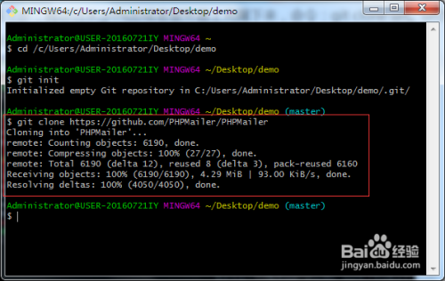

# git
```
…or create a new repository on the command line
echo "# VNote" >> README.md
git init
git add README.md
git commit -m "first commit"
git branch -M main
git remote add origin https://github.com/ccccccccccooooo/VNote.git
git push -u origin main

…or push an existing repository from the command line
git remote add origin https://github.com/ccccccccccooooo/VNote.git
git branch -M main
git push -u origin main
```

## 新建一个github本地仓库
```cpp
git init
```
## 配置config
```cpp
git config --global user.name "用户名"
git config --global user.email "电子邮箱"
```
## 添加目录
```cpp
git add 目录
git add .
```
## 克隆到本地

在本地新建一个文件夹，作为本地仓库，如“demo”。打开git，输入命令：

cd /c/Users/Administrator/Desktop/demo  然后按回车键进入到该文件夹目录下，如下图：


第二步：将本地仓库初始化，命令：git init  如下图：


第三步：将你需要的项目从github或者服务器上克隆下来，命令：git clone url   url为项目服务器地址或github地址，我这里以克隆github上的PHPMailer项目为例子，如下图所示：



## ! [rejected] master -> master (fetch first)问题的解决方案


分析原因，基本上可以确定是因为github上的远程库与本地库版本不一致（我对github上的文件做了编辑操作，且未更新到本地，当然也可能还有其他原因…），通过一番研究，找到了两种解决方案：

### 温柔型方案：

1. 通过git pull 先将本地库更新到与远程库一致的版本，但要注意本地库后来做的修改可能被覆盖，最好使用git fetch(不会自动合并)，查看更新情况再有选择合并，或者先将本地库修改过的文件备份，git pull后再重新修改；
2. 再运行git push即可成功。

### 暴力型方案：

1. git提供了一种强制上传的方式：git push -f ，它会忽略版本不一致等问题，强制将本地库上传的远程库，但是一定要谨慎使用，因为-f会用本地库覆盖掉远程库，如果远程库上有重要更新，或者有其他同伴做的修改，也都会被覆盖，所以一定要在确定无严重后果的前提下使用此操作。
   