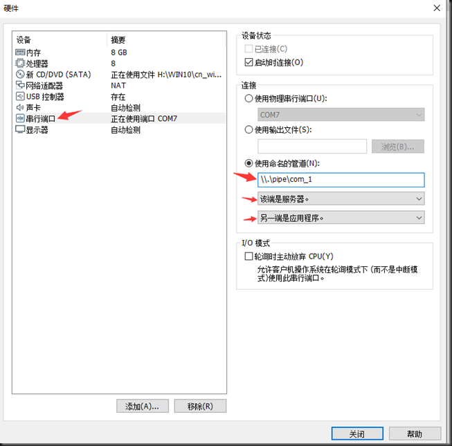
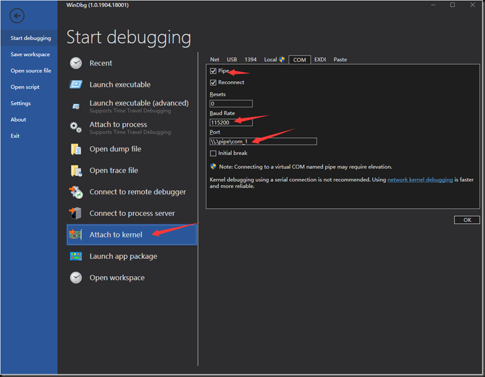
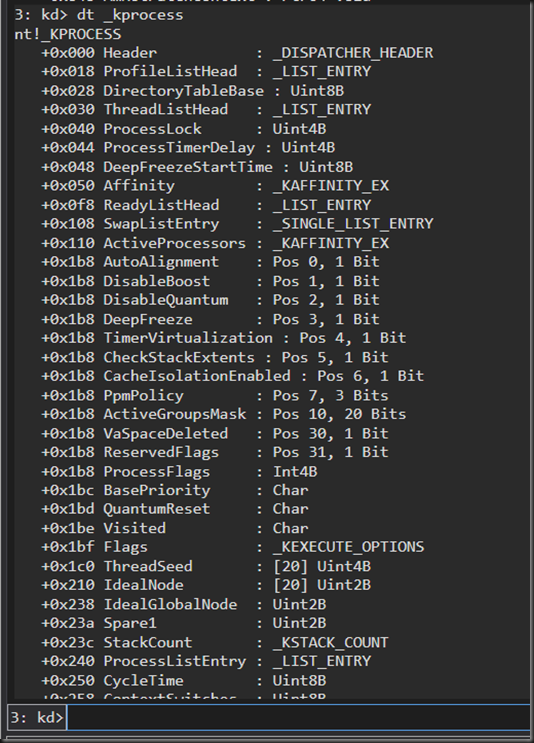
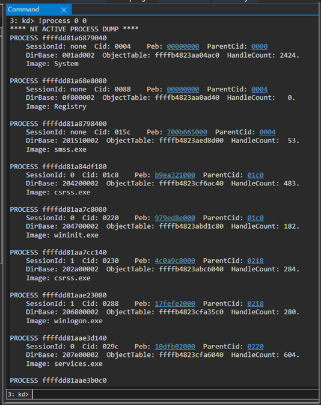

# 配置双机调试
## 0x00 前期准备：

主机安装Windbg

主机安装VMware

在VMware中安装Win10LTSC并且激活


主机配置符号文件相关的环境变量：

_NT_SYMBOL_PATH
SRV*D:\Symbols\LocalSymbols*http://msdl.microsoft.com/download/symbols

## 0x01 虚拟系统配置：
在虚拟系统设置的硬件一栏，删除打印机之后添加串口(打印机会占用串口1)：

配置串口：

## 0x02 修改虚拟系统启动选项：
在虚拟系统中以管理员身份启动powershell，执行 bcdedit /enum 查看启动配置：

依次执行以下命令：

bcdedit  /set  “{current}”  bootmenupolicy  Legacy             //修改启动方式为Legacy

bcdedit  /dbgsettings  SERIAL  DEBUGPORT:1  BAUDRATE:115200     //设置串口1为调试端口，波特率为115200

bcdedit  /copy  “{current}”   /d  “Debug”      //将当前配置复制到 Debug 启动配置(新建了Debug启动配置)


记录一下新建的启动配置的标识符，然后执行下面的命令：

bcdedit  /debug  “{<新建的启动配置的标识符>}”   on        //打开调试开关

bcdedit  /enum      //查看配置


## 0x03 验证配置：
重启虚拟系统：

可以看到前面配置的 Debug 启动配置已经生效了

打开 Windbg ，设置挂接选项：

设置完毕点击OK之后，虚拟系统选择 Debug 选项启动，Windbg成功中断：

双机调试配置成功，可以在命令窗口输入命令控制虚拟机里面的Win10系统
## 0x04 Windbg的简单使用：
lm     //查看系统当前的模块

上图中只加载了 nt 模块的符号文件，可以使用 ld 命令强制加载其他模块的符号文件：

查看指定模块内的符号(nt模块中以z开头的符号)：

查看内核中的结构体信息(_kprocess结构体)：

查看系统当前运行的进程信息：


# 1. 第一篇 基础篇
## 1.1. 第一章 内核编程环境
### 1.1.1. 1.2 编写第一个C文件
请打开Visual Studio，坐上角的菜单中选中“文件 （F）”→“新建（N）”→“项目（P）”，在弹出的对话框中的左侧，找到并选中“Windows Drivers”，工程名字输入：FirstDriver。


点击“确定”按钮后完成项目的新建，然后在菜单中找到“项目（P）”→“添加新项”，在弹出的对话框中选择“C++文件(.cpp)”，在下方的名称（N）中输入“First.c”，最后点击添加。

在写代码前，需要包含驱动开发的头文件htddk.h。

### 1.1.2. 1.2.2内核入口函数
DriverEntry函数的原型如下：
```cpp
NTSTATUS DriverEntry(
	PDRIVER_OBJECT DriverObject,
	PUNICODE_STRING RegistryPath
)
```
首先为读者介绍DriverEntry的参数，一共有两个。
**第一个参数为DriverObject，表示一个驱动对象的指针**，读者可以先简单的认为，一个驱动文件（sys）运行之后，操作系统在内存中为该驱动分配了一个类型为DRIVER_OBJECT的数据结构，用于记录该驱动的详细信息，DriverEntry的第二个参数，就表示当前驱动所对应的驱动对象指针；
**第二个参数RegistryPath是一个类型为UNICODE_STRING的指针**，表示当前驱动对应的注册表位置。UNICODE_STRING是内核中表示字符串的结构体，对应定义如下：
```cpp
typedef struct _UNICODE_STRING {
    USHORT Length;
    USHORT MaximumLength;
    PWCH   Buffer;
}
```
其中Buffer为一个指针，指向一个UNICODE类型的字符串缓冲区；
MaximumLength表示Buffer所指向缓冲区的总空间大小，一般等于Buffer被分配是的内存大小，单位为字节；Length表示Buffer所指向缓冲区中字符串的长度，单位也是字节。请注意，Buffer所指向的字符串，并不是要求以'\0'作物结束，在大多数情况下，Buffer指向的字符串没有以'\0'结尾。
下面为读者介绍DriverEntry的返回值，DriverEntry的返回值类型为NTSTAUTS而NTSTAUTS定义为：
```cpp
typedef LONG NTSTATUS;
```
由此可见,DriverEntry的返回值实际上是一个LONG类型,Windows操作系统规定DriverEntry的返回STATUS_SUCCESS表示成功,返回其他值表示失败。STATUS_SUCCESS实际上是一个宏定义，具体定义为：
```cpp
#define STATUS_SUCCESS                   ((NTSTATUS)0x00000000L)
```
### 1.1.3. 1.2.3编写入口函数体
```cpp
#include <ntddk.h>

//卸载函数
void DriverUnload(PDRIVER_OBJECT DriverObject)
{
	if (DriverObject != NULL)
	{
		DbgPrint("[%ws]Driver Upload,Driver Object Address:%p", __FUNCTIONW__, DriverObject);
	}
	return;
}

//入口函数
NTSTATUS DriverEntry(
	PDRIVER_OBJECT DriverObject,//驱动对象
	PUNICODE_STRING RegistryPath//注册表位置
)
{
	DbgPrint("[%ws]Hello Kernel World\n", __FUNCTIONW__);
	if (RegistryPath != NULL)
	{
		DbgPrint("[%ws]Driver RegistryPath:%wZ\n", __FUNCTIONW__, RegistryPath);
	}
	if (DriverObject != NULL)
	{
		DbgPrint("[%ws]Driver Object Address:%p\n", __FUNCTIONW__, DriverObject);
		DriverObject->DriverUnload = DriverUnload;//指定卸载函数
	}
	return STATUS_SUCCESS;//返回成功
}
```
上面的代码中，第一行包含了内核开发所需的头文件ntddk.h，接下来是一个DriverUnload函数，最后是驱动的入口函数DirverEntry。
首先分析DriverEntry函数，该函数内部使用DbgPrint函数打印一条日志，DbgPrint函数是WDK提供的API（应用程序编程接口），类似应用层的OutputDebugString。DbgPrint于C语言的printf使用基本一样。
与DbgPrint函数功能类似的是KdPrint函数,但KdPrint函数只是针对DEBUG版本的驱动有效，关于驱动DEBUG版本的介绍，请参考下一节。
在第一个DbgPrint函数中，"[%ws]Hello Kernel World\n"为格式化字符串，表示输出的具体日志内容，该字符串包含了需要格式化的字段，其中%ws表示打印一个以'\0'结束的UNICODE字符串（注意，不是UNICODE_STRING）；__FUNCTIONW__是以'\0'结束的UNICODE字符串，表示当前函数的名字，对应格式化字符串中的%ws。

DriverEntry函数接下来判断两个参数值是否为NULL，不为NULL的情况下打印两个参数值，请读者注意，由于RegistryPath是UNICODE_STRING类型，打印该类型字符串需要用%wZ的方式来打印，特别指出，不能通过一下方式打印UNICODE_STRING：
```cpp
DbgPrint("[%ws]Driver RegistryPath:%ws\n",__FUNCTIONW__,RegistryPath->Buffer);
```
原因上面已经提及，UNICODE_STRING结构体内Buffer指向的字符串，结尾不一定有'\0'，而对于%ws类型来说，会一直寻找Buffer字符串的'\0'，在这种情况下，行为是不可预料的。

DriverEntry函数除了打印一系列信息，还有一个重要的操作：
```cpp
DriverObject->DriverUnload = DriverUnload;
```
DriverUnload是DriverObject结构体中的一个成员，相信读者对DriverObject已经不陌生了，DriverObject表示当前的驱动对象，记录了当前的驱动的详细信息，DriverUnload为驱动对象结构体内的一个函数指针。

前面提过,驱动是作为服务方式运行的，服务可以被启动，也可以被停止，停止的实质就是系统把该驱动模块对应在内核地址空间中的代码以及数据移除。当一个内核驱动被要求停止时，DriverObject->DriverUnload指向的函数就会被系统调用，开发者可以在这个函数中执行一些清理相关的工作。举一个例子，假设驱动A内部启动了一个线程B，当驱动A被要求停止时，如果开发者没有在DriverUnload函数中停止线程B，一旦驱动A被停止，线程B对应驱动A的代码已被系统删除，线程B在执行过程会触发缺页异常，最终导致系统异常。

DriverUnload函数非常重要，但重要并不等于必须，Driver Unload函数是可选的，开发者可以不提供Driver Unload函数，这样做的结果是该驱动不支持停止，也就是说，只要开发者不提供Driver Unload函数，这个驱动对应的服务一旦启动后，再也无法停止。该特性被很多安全软件利用，刻意不提供Driver Unload函数，避免驱动被恶意停止。

DriverEntry函数执行一系列操作后，最后返回STATUS_SUCCESSAA，表示驱动初始化成功。本章前面介绍过，DriverEntry函数返回除STATUS_SUCCESS以外的其他值时，表示驱动初始化失败，系统发现驱动初始化失败会移除内核地址空间的驱动代码于数据，这个操作看起来于服务的停止非常类似，但是请读者注意：驱动初始化失败不会触发DriverUnload函数的调用，DriverUnload只有在驱动服务成功启动（初始化）后，被要求停止时才会触发，请读者谨记。

## 1.2. 2.2以服务安装驱动
```cpp
#include <Windows.h>
#include <iostream>
#include <tchar.h>

#define SER_NAME _T("FirstDriver")

int main(void)
{
	SC_HANDLE hSCM = NULL;
	SC_HANDLE hSer = NULL;

	do
	{
		hSCM = OpenSCManager(NULL, NULL, SC_MANAGER_CREATE_SERVICE);
		if (hSCM == NULL)
		{
			break;
		}
		hSer = CreateService(
			hSCM,						//句柄
			SER_NAME,					//服务名称
			SER_NAME,					//服务显示的名字
			SERVICE_ALL_ACCESS,			//所以权限打开
			SERVICE_KERNEL_DRIVER,		//内核类型的服务
			SERVICE_DEMAND_START,		//服务启动类型，这里是手动启动
			SERVICE_ERROR_IGNORE,		//错误类型
			_T("C:\\FirstDriver.sys"),	//sys文件所在的磁盘目录
			NULL,						//服务所在的组，不关心顺序，传递NULL
			NULL,						//服务的Tag，这里不关心，传递NULL
			NULL,						//服务的依赖，这里没有依赖，传递NULL
			NULL,						//服务的启动用户名，传递NULL
			NULL);						//服务启动用户名对应的密码，传递NULL
		if (hSer == NULL)
		{
			DWORD dwErrorCode = GetLastError();
			if (dwErrorCode == ERROR_SERVICE_EXISTS)
			{
				//ERROR_SERVICE_EXISTS表示服务已经存在，不能重复注册，属于正常的情况
				hSer = OpenService(hSCM, SER_NAME, SERVICE_ALL_ACCESS);
				if (hSer == NULL)
				{
					//打开失败
					break;
				}
			}
			else
			{
				break;
			}
		}
		printf("CreateService or OpenService succ \n");
		getchar();
		//准备启动服务
		BOOL bSucc = StartService(hSer, NULL, NULL);
		printf("ControlService:%u\n", bSucc);
		//停止服务
		SERVICE_STATUS SerStatus = { 0 };
		bSucc = ControlService(hSer, SERVICE_CONTROL_STOP, &SerStatus);
		printf("ControlService:%u\n", bSucc);
		getchar();
		//下面开始删除服务
		DeleteService(hSer);
	} while (FALSE);

	if (hSCM != NULL)
	{
		CloseServiceHandle(hSCM);
		hSCM = NULL;
	}
	if (hSer != NULL)
	{
		CloseServiceHandle(hSer);
		hSer = NULL;
	}
	return 0;
}
```
### 1.2.1. 打开服务管理器
打开服务管理器的函数为OpenSCManager，原型如下：
```cpp
SC_HANDLE WINAPI OpenSCManager(
    LPCTSTR lpMachineName,
    LPCTSTR lpDatabaseName,
    DWORD dwDesiredAccess
    );
```
**第一个参数**比较简单，为一个字符串常量，表示机器的名字，读者可以简单传递一个NULL，表示打开的是本机器的服务管理器。

**第二个参数**也是一个字符串常量，表示数据库的名字，读者也可以简单传递一个NULL，表示打开的是一个活动（Active）数据库。

**第三个参数**比较关键，为一个DWORD类型的值，表示权限。开发者通过服务管理器去操作服务时，不同的操作需要不同的权限。常用的服务管理器有：

•SC_MANAGER_CREATE_SERVICE：表示拥有注册（创建）服务的权限。

•SC_MANAGER_ENUMERATE_SERVICE：表示拥有枚举系统服务的权限。

•SC_MANAGER_ALL_ACCESS:表示拥有一切权限。

**返回值**函数返回一个类型为SC_HANDLE的句柄。

当这个服务管理器句柄不再需要使用，开发者需要调用CloseServiceHandle函数来关闭句柄。

### 1.2.2. 服务注册
注册（创建）一个服务使用的函数为CreateService，该函数原型如下：
```cpp
SC_HANDLE
WINAPI
CreateService(
    SC_HANDLE    hSCManager,
    LPCSTR     lpServiceName,
    LPCSTR     lpDisplayName,
    DWORD        dwDesiredAccess,
    DWORD        dwServiceType,
    DWORD        dwStartType,
    DWORD        dwErrorControl,
    LPCSTR     lpBinaryPathName,
    LPCSTR     lpLoadOrderGroup,
    LPDWORD      lpdwTagId,
    LPCSTR     lpDependencies,
    LPCSTR     lpServiceStartName,
    LPCSTR     lpPassword
    );
```
•hSCManager表示“服务管理器”句柄，关于如何打开服务管理器获取句柄，上一节已经介绍，这里需要提醒的是，由于本操作是注册（创建）服务，所以在服务管理器的时候需要使用SC_MANAGER_CREATE_SERVICE权限。

•lpServiceName表示需要创建服务的名字，这个名字不能于其他存在服务的名字相同。服务名字是服务的唯一标识。

•dwDesiredAccess表示服务的权限，读者可能会有疑问：这个函数的功能是（创建）一个服务，为什么还需要指定服务的权限？这是因为CreateService函数内部注册（创建）服务成功后，还会打开这个创建好的服务。常见的场景是：开发者注册（创建）服务后，还会通过这个函数返回的服务句柄来启动服务，这个时候就需要指定SERVICE_START权限。常见的权限有：

SERVICE_START：拥有启动服务的权限。

SERVICE_STOP：拥有停止服务的权限。

SERVICE_QUERY_STATUS：拥有查询服务状态的权限。

SERVICE_ALL_ACCESS：拥有一切权限。

•dwServiceType表示需要创建何种类型的服务，服务的类型有：

SERVICE_FILE_SYSTEM_DRIVER（文件系统服务）

SERVICE_KERNEL_DRIVER（内核驱动服务）

SERVICE_WIN32_OWN_PROCESS（应用层服务），以及SERVICE_WIN32_SHARE_PROCESS（应用层共享EXE服务）。

•dwStartType表示服务的启动方式，这个启动方式是以操作系统的启动顺序来划分的，常见的有（按照启动顺序来划分）：

SERVICE_BOOT_START：操作系统引导阶段启动的服务，一般由Winload模块负责加载服务对应的可执行文件到内存。

SERVICE_SYSTEM_START：操作系统启动阶段启动的服务，由系统NT模块负责加载服务对应的可执行文件到内存。

SERVICE_AUTO_START：操作系统启动完毕后启动服务。

SERVICE_DEAND_START：需要手动启动的服务。

•dwErrorControl表示错误控制，具体指服务启动失败情况下，操作系统需要执行何种操作，常见的有

SERVICE_ERROR_CRITICAL

SERVICE_ERROR_IGNORE

SERVICE_ERROR_NORMAL

SERVICE_ERROR_SEVERE

对应驱动来说，指定SERVICE_ERROR_IGNORE即可

•lpBinaryPathName表示该服务对应可执行文件的路径，对应可执行文件的全路径，对于驱动类型的服务来说，这里指定的就是sys文件所在的路径。

•lpLoadOrderGroup服务所在分组的名字，可以简单的设置为NULL。

•lpdwTagld表示服务在分组内的一个标识，可以把参数设置为0。

•lpDependencies表示当前所注册的服务，需要依赖其他服务名的列表。

•lpServiceStartName与lpPassword表示当前以什么用户身份启动服务，对于驱动类型的服务，简单指定NULL即可。

CreateService函数的返回值为一个服务的句柄，前面提到服务成功创建后，CreateService函数内部会打开这个服务，开发者可以通过CreateService返回的服务句柄来操作服务，使用完毕后需要调用CloseServiceHandle函数关闭句柄。在很多情况下，开发者需要操作服务，但服务已经存在，开发者不需要重新注册（创建）服务，在这种情况下，开发者需要“打开”已经存在的服务，通过OpenService函数打开服务OpenService函数的原型如下：
```cpp
SC_HANDLE
WINAPI
OpenServiceA(
    SC_HANDLE             hSCManager,
    LPCSTR                lpServiceName,
    DWORD                 dwDesiredAccess
    );
```
hSCManager的含义与CreateService函数hSCManager的含义相同，表示服务管理器句柄，lpServiceName表示需要打开的服务名字（切记，服务名是服务的唯一标识），dwDesiredAccess含义与CreateService函数的dwDesiredAccess含义相同，表示需要以何种权限打开服务的句柄。OpenService成功打开服务后返回服务的句柄，开发者可以通过这个句柄操作服务，使用完毕后需要调用CloseServiceHandle函数关闭句柄。

### 1.2.3. 服务的启动与停止
启动服务使用StartService函数，函数原型如下：
```cpp
BOOL
WINAPI
StartServiceA(
    SC_HANDLE            hService,
    DWORD                dwNumServiceArgs,
    LPCSTR             *lpServiceArgVectors
    );
```
其中hService为服务的句柄，表示需要启动的服务。dwNumServiceArgs与lpServiceArgVectors表示服务启动时所需要传递的参数，都可以设置为NULL。

停止服务所使用的函数为ControlService，ControlService函数除了可以停止服务，还可以暂停服务、恢复服务等，但大部分操作都是针对用户态服务来说的，ControlService函数原型如下：
```cpp
BOOL
WINAPI
ControlService(
    SC_HANDLE           hService,
    DWORD               dwControl,
    LPSERVICE_STATUS    lpServiceStatus
    );
```
其中hService为服务的句柄，表示需要操作的服务。

dwControl为控制码，表示需要对服务进行何种操作，系统定义了一系列值，如SERVICE_CONTROL_PAUSE、SERVICE_CONTROL_STOP、SERVICE_CONTROL_CONTINUE等，如果需要停止服务，请传入SERVICE_CONTROL_STOP。

lpServiceStatus参数是一个返回参数，表示服务当前最新的状态，这些状态保存在SERVICE_STATUS结构体中。

### 1.2.4. 服务的删除
使用DeleteService函数可以删除一个指定的服务，函数原型如下：
```cpp
BOOL
WINAPI
DeleteService(
    SC_HANDLE   hService
    );
```
参数为服务句柄。

### 1.2.5. 命令行安装、启动、停止、卸载
sc create、sc start、sc stop、sc delete

## 1.3. 驱动的调试

1. 在被调试机器中运行cmd->输入：bcdedit /debug on(把调试机器设置成调试模式)
2. bcdedit /dbgset-tings net hostip:192.168.116.1 port:50010
3. 保存Key
4. 在调试的机器中配置，首先打开VS
5. 在VS菜单栏中找到"Driver"中找到"Test"->"Configure Devices"
6. 点击“Add New Device”
7. 在"Display name"下面输入设备的名字，例如：MyFirstDevice
8. 在"Device Type"下面的下拉框中选择"Computer"
9. Network host name下面输入被调试机器的hostname,也可以输入IP
10.选择第二项"Manually configure debuggers and do not provision"